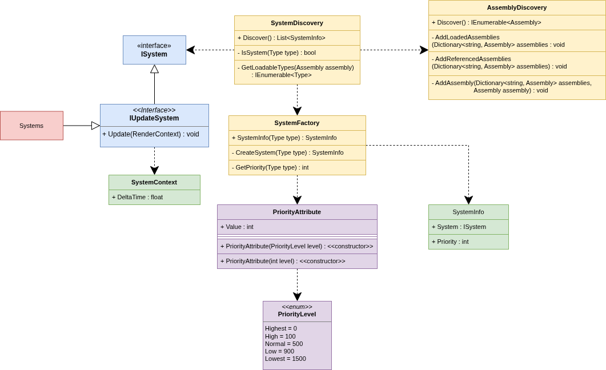

# Systems Core

## Basic idea
MiniEngine uses an **Entity-Component-System (ECS)** architecture. You can read more about ECS in the main architecture overview. 

But the systems are made for editing the components or any other possible data. Instead of putting behavior directly inside components, the logic is handle by ```systems```.

### Diagram


Our prepared systems are automatically set to receive ```SystemContext```, which should contains all the data required for systems to execute.

## System architecture
The system architecture is designed so that user **does not** need to manualy register every new system.

To create a system, simply create a class and implement one of the listed **template interfaces** and give it priority. The engine discovery mechanism will find the system automatically and register it for the correct execution phase, based on the priority given.

### Currently, there is one system template:
- ```IUpdateSystem``` - for systems that need to execute during the update phase.

## Most important parts
```ISystem```
Base interface for all system types. Every system template must inherit from this interface so it can be discovered by the engine.

```IUpdateSystem```
System template for systems that require an Update() method.

```SystemContext```
Contains data provided by the engine to systems during execution.

```SystemDiscovery```
Finds classes implementing system interfaces and prepares them for registration.

## How to use specifically 

Create a system class, in your desired location

```using static MiniEngine.Systems.Core.PriorityLevel;``` - This tells it that we won't mention PriorityLevel.High but we can use just High

There is attribute ```[Priority(Highest)]``` which essentially tells MiniEngine when the system should be executed, on the added diagram you can see how are the priorities set by default, but if you don't like it you can always use ```[Priority(150)]``` integer value
```
using MiniEngine.Systems.Core;
using static MiniEngine.Systems.Core.PriorityLevel; 

[Priority(Highest)]
public class HelloWorldSystem : IUpdateSystem
{
    public void Update(SystemContext x)
    {
        // Your system logic 
    }
}
```
Just the ```x``` it is used Engine-Wide but you can use whatever you like just a recommendation, put something short or use the ```x```  